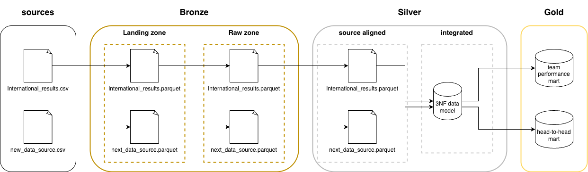

# Rugby medallion lakehouse

## Overview
A rugby medallion data lakehouse project to answer any and all of your burning Rugby data questions. 

The first step in this project is an MVP step, there will be limited data and technologies. The MVP was to establish a local only, end-to-end lakehouse setup to answer one question. What are the win statistics between rugby's greatest rivalry (South Africa vs New Zealand)? 

## Pipeline Overview

### Bronze 
- landing stage: The accept all, no friction entry for data into the data lakehouse
- raw stage: Silver structure aligned data, detecting schema changes

### Silver
- source aligned: Deduplicated, cleaned, confirmed data aligned to each source
- 3NF: Point in time single source of truth records

### Gold
- Data marts serving analytical questions.

## Design decisions

1. Two-stage bronze (landing & raw)
Allows for quickly identifiying schema drift from a source. The process from landing to raw focuses on the shape of the data (number of colums etc)

2. 3nf integrated silver layer that serves as a single source of truth for the gold layer rather than leveraging silver aligned sources. This would ensure the additional sources being added in subsequent steps will have a survivorship step. Also I wanted to practice my 3nf data modelling

3. Technology stack (juypter notebook, uv, duckdb, polars, dbt). Use a modern, local stack that required minimal setup without containerization or exensive resource use on a laptop. Polars syntax is similar to pyspark, renforcing the practice and duckdb serves as the database

## Data quality & lineage.
Data lineage is stored throughout the process through each layer with associated metadata fields stored per row of data. This allows for each row to track the full lineage, version of code and run produced the row. The metadata is as follows:

- Pipeline id: Unique identifier of the code version
- Run idd: Unique identifier set by the orchestrator.
- Bronze landing date: The date the row ingested into bronze landing zone.
- Bronze raw date: The date the row was ingested into the bronze raw zone.
- Date processed: The date the row was processed into the silver source-aligned zone.
- Business key hash: The combination between source and business attributes.
- Source row hash: A combination of all the rows for a source, that is used for source-side changes.
- Integrated row hash: Key of an attribute in the silver 3nf model
- hash: Identified for gold dimensions 

## AI usage

The purpose of the this project was learning and reinforcing data engineering practices and principles, not speed. No AI was used in the creation of this project.

## Data Sources
|  Source |  link | file  |
|---|---|---|
|  Kaggle | https://www.kaggle.com/datasets/lylebegbie/international-rugby-union-results-from-18712022  | results.csv  |

## Roadmap
1. MVP (minimal data, contains the bones of full medallion architecture)
2. Fix known data issues, competition and Stadiums
3. Add conical sources for country, stadium
2. Add additional kaggle rugby datasets
3. Scrap data results from r/rugbyunion
4. Integrate LLM functionalty